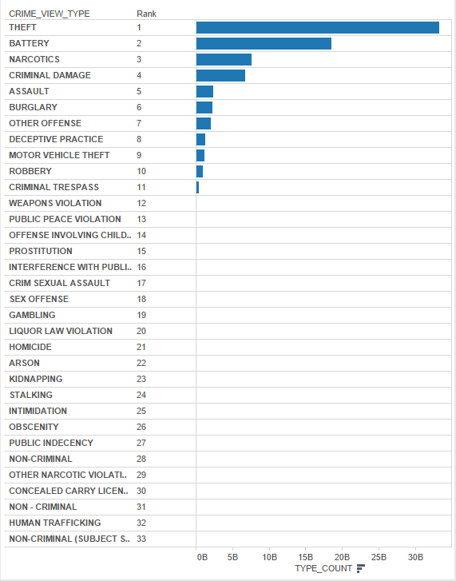
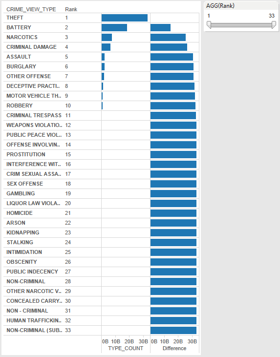
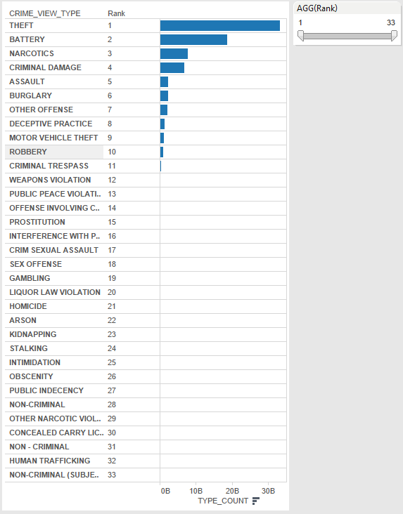

```{r, echo=FALSE}
source('../00 Doc/.RProfile')
```


The data used in this project takes the crimes from the city of Chicago from the year 2001 through the present and analyzes for aggregation at distinct types of crimes.


###Crosstab Dataframes
In this project, Dataframes were created using sql queries to create cross tabulations. Each table is presented below with its respective SQL Query.

####Ranking
Here is the sql query:

```
SELECT type, rank() OVER (order by type_count desc) as type_rank from CRIME_VIEW;
```

Here is how the dataframe looks:

```{r}
source("../01 SQL Crosstabs/crosstabs 1.R")
tbl_df(df)
```

Here, the rank of the type of crimes can be seen. the rank() function was implemented in the query to achieve this.


####Max Value/Differences
Here is the sql query:

```
SELECT type, last_value(max_type) OVER (order by type_count) max_type, last_value(max_type) OVER (order by type_count) - type_count type_diff FROM (SELECT type, type_count, max(type_count) OVER (ORDER BY type_count desc) max_type 
FROM CRIME_VIEW) ORDER BY type_diff asc;
```

Here is how the dataframe looks:

```{r}
source("../01 SQL Crosstabs/crosstabs 2.R")
tbl_df(adf)
```

Here, the difference between the highest ranked crime and the crime type in question. Both the last_value() and max() functions were implemented.

####Nth Value
Here is the sql query:

```
SELECT type, type_count, nth_value(type_count, 2)
OVER (ORDER BY type_count desc) second
FROM CRIME_VIEW
ORDER BY 2,3 desc;
```

Here is how the dataframe looks:

```{r}
source("../01 SQL Crosstabs/crosstabs 3.R")
tbl_df(bdf)
```

Here, the data allowing to view the data in terms of the nth value. The nth_value() function was implemented.

####Cumulative Distribution

Here is the sql query:

```
SELECT type, type_count, cume_dist() 
OVER (ORDER BY type_count asc) cume_dist
from CRIME_VIEW
order by 2,3 desc;
```

Here is how the dataframe looks:

```{r}
source("../01 SQL Crosstabs/crosstabs 4.R")
tbl_df(cdf)
```

This dataframe takes the data and finds the cumulative distribution. The cume_dist() function is implemented here.


##Tableau Representations
***

Here are the Tableau representations of the dataframes presented above in order.




